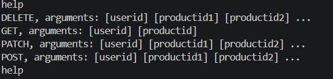
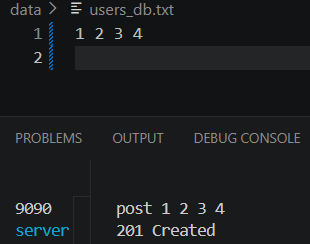
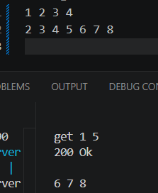
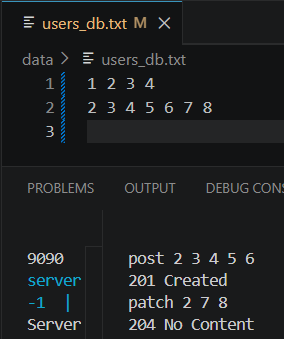
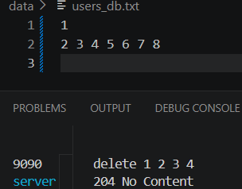

# Product Management REST API Server

This project is a C++ REST API server application designed to manage user product history. It provides HTTP-like endpoints to add, retrieve, update, and delete user product data, with persistent storage and a socket-based command architecture. A Python client is included for easy interaction with the server.

## Architecture & Design Principles

The system was built with a focus on SOLID principles and Loose Coupling to ensure future extensibility.


## SOLID & Future-Proof Design
We designed the system to be modular and easy to extend by following SOLID principles:

- Flexible Commands (Built as SOLID): Using the Command Pattern and a central map allowed us to add or rename commands (like GET) without changing the core code. To split the original add logic into POST and PATCH without duplicating code, we introduced a BaseAddCommands class. This allowed us to extend functionality while keeping the core execution logic untouched.

- Clean Output (Improved to SOLID): We didn't follow a SOLID approach for output. However, we fixed this by implementing a custom exception system. This separates status codes (like 400 Bad Request) from the command logic, making future changes much simpler.

- Seamless Connectivity (Built as SOLID): By using the Strategy Pattern with IInput and IOutput interfaces, we swapped the Console for Network Sockets with zero changes to the internal logic.

### Design Patterns Used

**Encapsulation and Interfaces:** Every command is encapsulated in its own class (POST, GET, PATCH, DELETE, Help), inheriting from a common `ICommand` interface. This allows for adding new commands without modifying existing code.

**Repository and Data Management:** Data access is abstracted via the `IUserRepo` interface. `MemoryUsers` handles persistent storage in the `data/users_db.txt` file, but can be swapped for a database implementation easily.

**Dependency Injection:** High-level modules like `App` do not depend on low-level details; instead, they receive interfaces and dependencies through their constructors.

**Server Architecture:** The `Server` class manages TCP socket connections, while `SocketIO` handles socket communication. The `App` class orchestrates command execution through a command map.

### Project Structure

```
Wolt/
├── data/                    # Persistent data storage (users_db.txt)
├── src/                     # All .cpp source files
├── include/                 # All header (.h) files
├── tests/                   # Unit tests for all components
├── CMakeLists.txt           # CMake build configuration
├── Dockerfile.server        # Docker configuration for server
├── Dockerfile.client        # Docker configuration for client
├── docker-compose.yml       # Docker Compose orchestration
├── client.py                # Python client for server communication
└── README.md                # Project documentation
```


## Docker Commands

**Build the containers properly:**
```
docker compose build
```

**Run tests without user input allowed:**
```
docker compose run --rm --entrypoint ./build/unit_tests server
```

**Run the project itself:**

   **Server using POWERSHELL:**
   ```
   $env:PORT=9090; docker compose up server
   ```
   **Server using CMD, LINUX and MACOS:**
   ```
   PORT=9090 docker compose up server
   ```

   **Client using POWERSHELL:**
   ```
   $env:PORT=9090; docker compose run client
   ```
   **Client using CMD, LINUX and MACOS:**
   ```
   PORT=9090 docker compose run client
   ```

**Stop services:**
```
docker compose down
```

## Program Usage And Commands

The application accepts the following commands:

**1. POST:** add [userid] [productid1] [productid2] ...
- Associates products with a user. Data is automatically persisted to `data/users_db.txt`

**2. GET:** get [userid] [productid]
- Retrieves user products and provides recommendations

**3. PATCH:** patch [userid] [productid1] [productid2] ...
- Updates existing user product associations

**4. DELETE:** delete [userid] [productid]
- Removes users or products from history

**5. HELP:** help
- Displays the list of supported commands

## Example:

**HELP**: as described, the command displays the list of all supported commands and their arguments: 
   

**POST**: as described, the command adds new product IDs to a user's history and persists the data:
   

**GET**: as described, it displays up to 10 recommendations based on a product ID and similarities with other users: 
     

**PATCH**: as described, the command updates a user's history by adding new product IDs to their existing list:
   

**DELETE**: as described, the command removes a specific user or specific products from a user's history:
   

